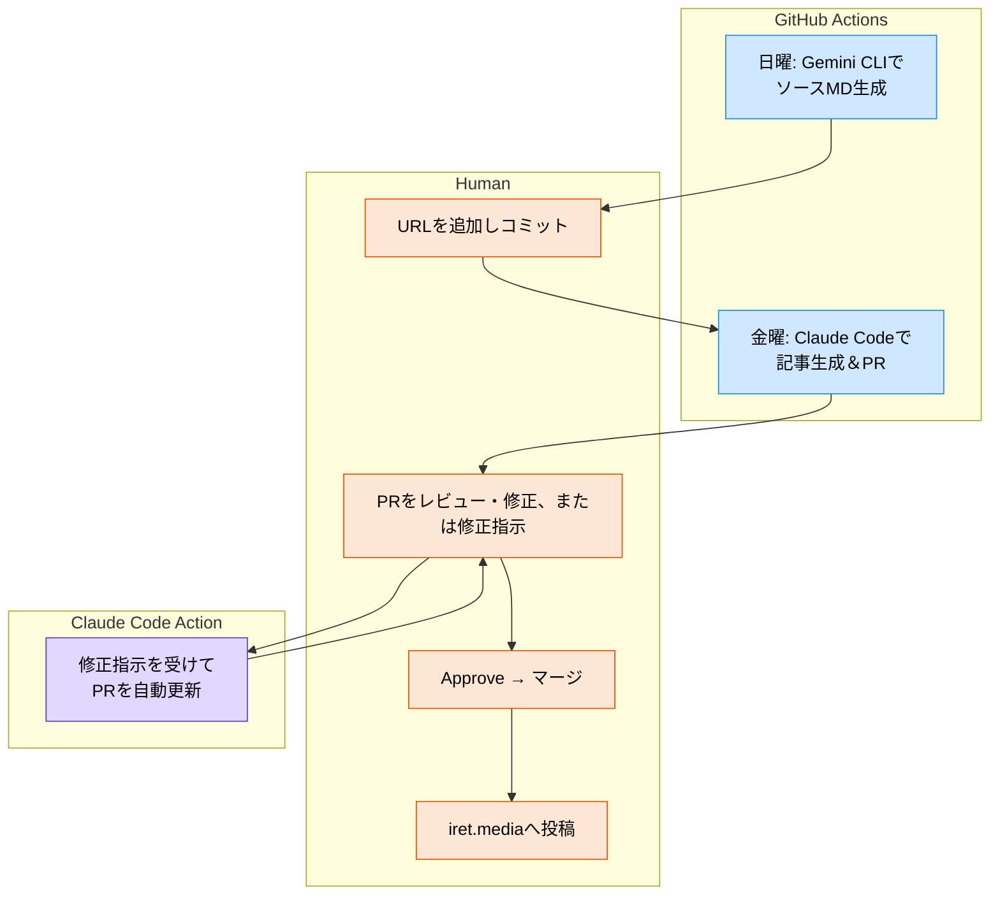

# はじめに

皆さんご存知でしょうか？
アイレットのオウンドメディア「[iret.media](https://iret.media/)」では、週刊で[生成AIニュースブログ](https://iret.media/tag/dx%e9%96%8b%e7%99%ba%e4%ba%8b%e6%a5%ad%e9%83%a8-presents-%e9%80%b1%e5%88%8a%e7%94%9f%e6%88%90ai%e3%83%8b%e3%83%a5%e3%83%bc%e3%82%b9)を投稿しています。

https://iret.media/159989

ちょうど一周年の節目にあたり、せっかくなので宣伝と企画の裏話がてら、どのように記事を作成しているかをこの記事でお話します。

# 初期
2024年の7月、執行役員の[@kaz_goto](https://x.com/kaz_goto)から生成AIニュースネタでこのような記事を始めてみないか？とアイデアを頂きました。

https://iret.media/28517

あまり深く考えず「面白そうっすね！やってみます！」で始めた記念すべき1記事目がこちら。

https://iret.media/109579

初期は、Xを巡回したり公式ブログのフィードから集めた目についたニュースを気合で要約してキュレーションしていました。
当時はWebサイトを参照できる生成AIツールが少なく要約も微妙だったので、このような運用をしてました。

基本的に公式の一次情報だけを扱うポリシーでやっているのですぐネタ切れになるかと思いきや、なんやかんや毎週何かしら生成AIのニュースがあるので今に至るまでネタ集めにはそんなに苦労しませんでした。

# 中期〜後期
だんだん1人じゃきつくなってきたので、部署のメンバーを巻き込み人海戦術で作成するようになります。
流石にそれでも辛いので要約用のツールを作成して、ハルシネーションチェックしながらまとめるようになります。

https://zenn.dev/iret/articles/slack-url-summarize-gemini

後半はバナーを画像生成して毎週変えたほうが生成AIらしいだろうと思いつき、[Figma AI](https://www.figma.com/ja-jp/ai/?context=localeChange)を使って量産したバナーを毎週切り替えるようになりました。

https://iret.media/154207

https://iret.media/155216

https://iret.media/155927

# 現在
そして現在、ちょうどこの号から大きく運用を変えほとんどの作業を生成AIで賄えるようになりました！

https://iret.media/158940

自動化は[Claude Code](https://docs.anthropic.com/ja/docs/claude-code/overview)の登場によって実現できました。

その仕組みを一部公開します！

## リポジトリ構成
毎週投稿される記事は一つのGitHubリポジトリで管理されています。

```text
/
├── CLAUDE.md
├── sources/                          # 記事情報ソースファイル
│   └── yyyy_mm_dd.md                 # 週次情報ソース
├── articles/                         # 生成記事
│   └── yyyy_mm_dd.md                 # 完成記事
├── .github/
│   ├── CODEOWNERS                    # 記事のレビュアーを指定
│   ├── PULL_REQUEST_TEMPLATE.md
│   └── workflows/
│       ├── claude_code_vertex.yaml   # Claude Code ActionをVertex AIで呼び出すためのワークフロー（参考： https://qiita.com/danishi/items/796042cfca5b1df4d1ca ）
│       ├── generate_articles.yaml    # 記事生成ワークフロー
│       └── initialize_source_md.yaml # ソース初期化ワークフロー
├── .gemini/                          # Gemini CLI設定
└── .claude/                          # Claude Code設定
    └── commands/                     # Claude Codeコマンド定義
        ├── initialize_source_md.md   # ソースファイル作成カスタムコマンド
        └── generate_articles.md      # 記事生成カスタムコマンド
```

特にプログラミング言語は使われておらず、Claude Code（一部Gemini CLI）が実行するプロンプトと、それを自動で動作させるためのGitHub Actionsワークフロー定義だけでできています。

## 記事投稿までのフロー

1. 毎週日曜に翌週の記事のネタとなるURLをリストするための、ソース用雛形のMarkdownファイルがGitHub Actionsでスケジュール実行されたGemini CLIによって生成され、GitHubにプッシュされる
1. 人間が見つけたネタをソースファイルに追加、コミットしていく
1. 金曜にGitHub Actionsでスケジュール実行されたClaude CodeがソースファイルをもとにWeb Fetchしながら記事やタグ情報を生成しPRを作成する
1. 作成されたPRを人間がレビュー、手動ないし[Claude Code Action](https://github.com/anthropics/claude-code-action)に修正を指示してブラッシュアップする
1. PRがApproveされたら、人間がマージし、完成した記事のMarkdownファイルと別途作り置いていたバナーを使ってiret.mediaに記事を作成、投稿を申請する



### ワークフロー
細かいプロンプトは門外不出ですが、ワークフローだけ抜粋するとこのような定義になっています。

Claude Code Actionがスケジュール実行に対応していないので、記事生成はローカルで行うしかないかと当初思っていましたが、ワークフローの中で直接Claude Codeをインストールして実行することでそこは解決できました。

```yaml:generate_articles.yaml
      - name: Install & Execute Claude Code
        run: |
          npm install -g @anthropic-ai/claude-code
          claude --allowedTools "Bash,WebFetch,Write" --verbose \
            "@.claude/commands/generate_articles.md の指示の内容に従い作成したファイルを \
            feature/{ファイル名} ブランチを作成して Push してください。\
            その後、gh pr create コマンドを使って Pull Request を作成してください。 \
            Pull Request は @.github/PULL_REQUEST_TEMPLATE.md の形式に従ってください。"
```

# これから
より自動化を進めかつ、さらに品質の高い記事ができるようフローはこれからもブラッシュアップしていきたいと思います。
いつまでやるかは未定ですが、生成AIのニュースが尽きるまで続けられればいいなと思います。

# Special Thanks
* [@kaz_goto](https://x.com/kaz_goto)
* [@tamuo774](https://x.com/tamuo774)
* [@ymnk1800](https://x.com/ymnk1800)
* [@yu_mae11](https://x.com/yu_mae11)
* [@hira46854918](https://x.com/hira46854918)
* [@te_yama](https://qiita.com/te_yama)
* [@gen_qij2d](https://x.com/gen_qij2d)
